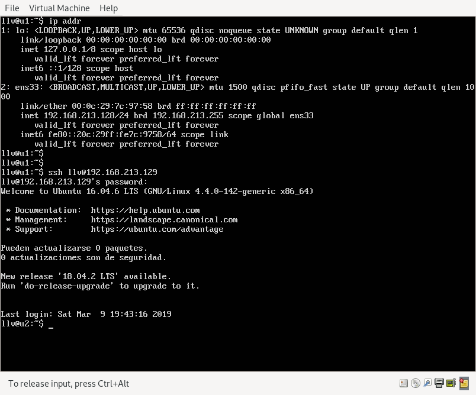
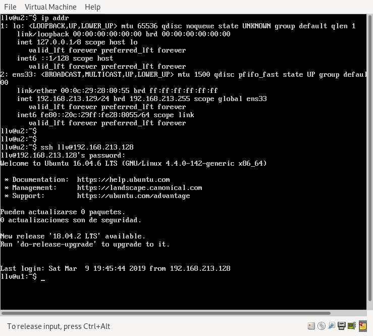
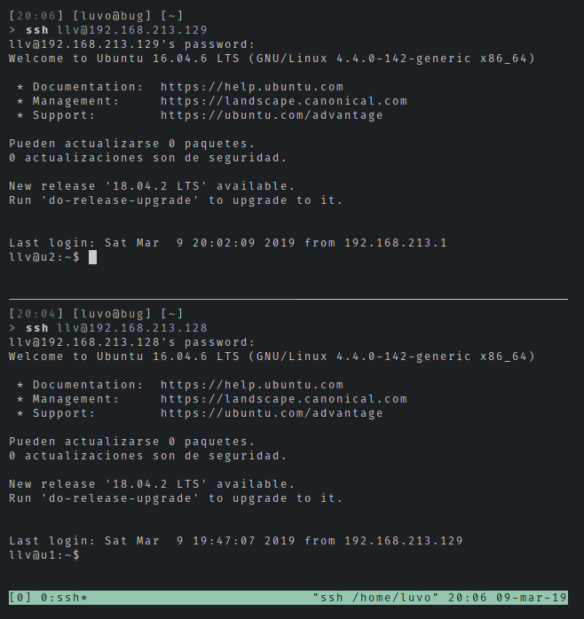
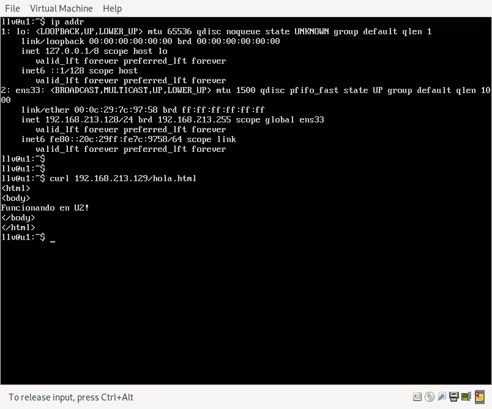
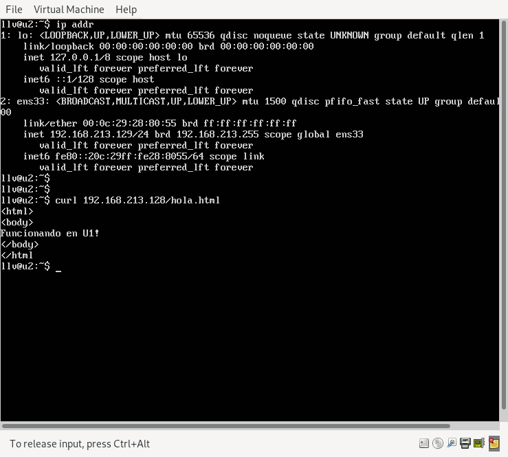
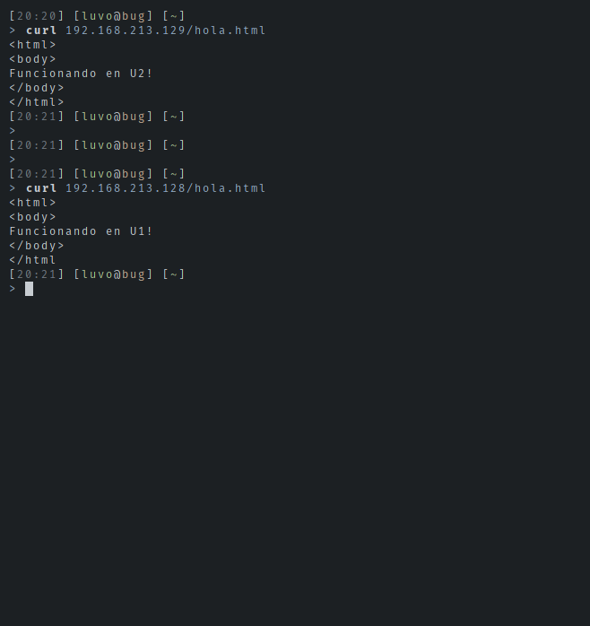

# Práctica 1: Preparación de las herramientas

Integrantes del grupo:

- Jorge Palma Ramirez
- Luis Liñán Villafranca

Tras la instalación y configuración de las dos máquinas virtuales y sus
sistemas operativos correspondientes, procedo a la experimentación de conexión
entre las máquinas y el host.

En las siguientes imágenes se muestran las distintas posibilidades de conexión
pedidas en el guión de prácticas.

### Acceso a través de ssh

* Acceso desde la máquina u1 a u2:

* Acceso desde la máquina u2 a u1:

* Acceso desde el host a las dos máquinas:

### Obtención de la página web

* Obtención de la web de la máquina u2 desde u1:

* Obtención de la web de la máquina u1 desde u2:

* Obtención de la web de las máquinas u1 y u2 desde el host:

