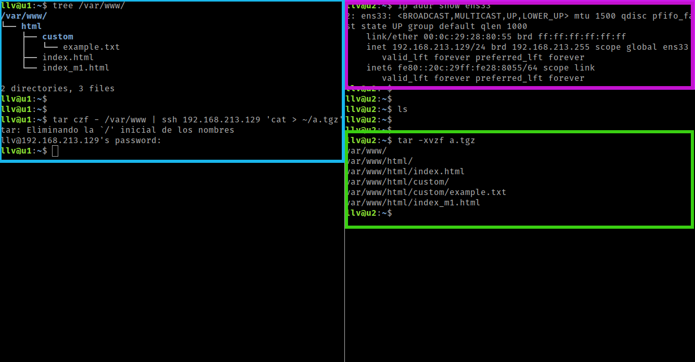
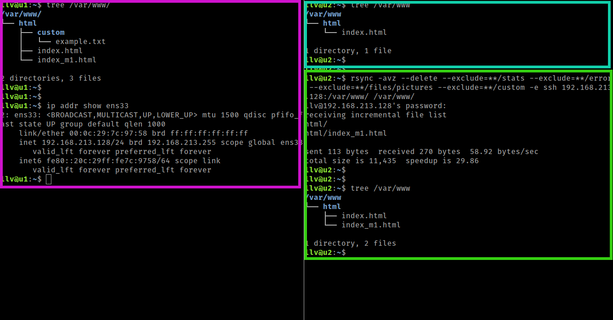
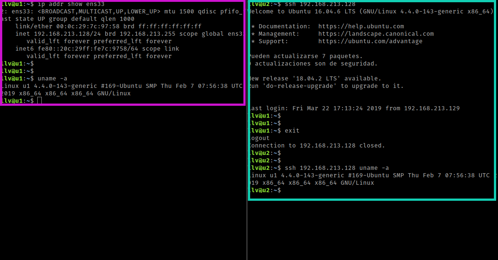
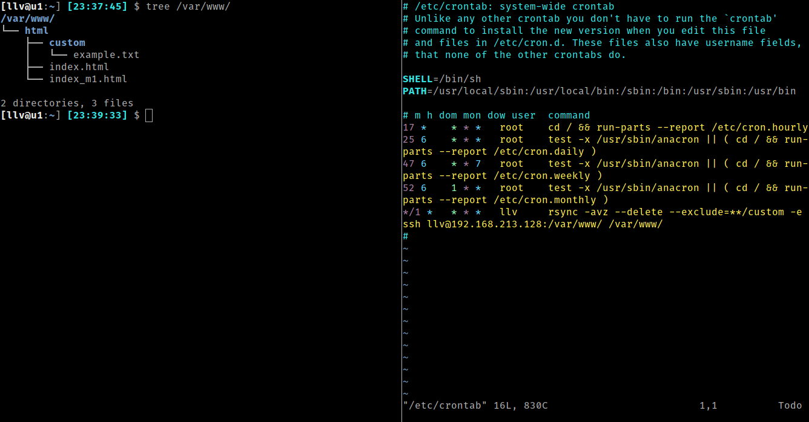
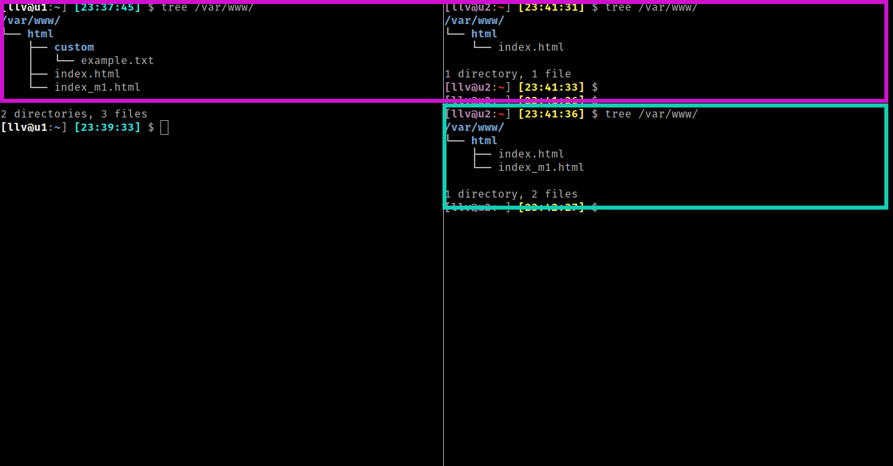

# Práctica 2: Clonar la información de un sitio web

Integrantes del grupo:

- Jorge Palma Ramirez
- Luis Liñán Villafranca

En esta práctica se desarrollará un método de clonado automático de datos entre
máquinas virtuales.

## Prueba de envío de archivos através de ssh

1. [Recuadro Morado] El primer paso es obtener la dirección ip de la máquina
   2 para poder conectarnos desde la otra máquina.

2. [Recuadro Azul] En la máquina 1, creamos una serie de archivos en un
   directorio para hacer la prueba y ejecutamos el comando de creación de un
   tar y lo enviamos por ssh como se muestra en el recuadro azul.

4. [Recuadro Verde] Finalmente, se observa la correcta funcionalidad del
   traspaso al descomprimir el archivo tar.

## Clonado de carpetas entre máquinas

1. [Recuadro Morado] Primero obtenemos la ip de la máquina de donde vamos a
   obtener los datos y mostramos el contenido de la carpeta a sincronizar.

2. [Recuadro Azul] Observamos en la máquina 1 que no disponemos de los archivos
   que se encuentran en la máquina 2.

3. [Recadro Verde] Ejecutamos el comando de rsync con algunas opciones y vemos
   que se sincroniza correctamente el directorio elegido.

## Conexión ssh sin contraseña

1. [Recuadro Morado] Mostramos la ip de la máquina la que nos queremos conectar
   sin necesidad de contraseña. También, enseñamos la salida de un comando
   ejecutado en la propia máquina.

2. [Recuadro Azul] Al intentar hacer ssh en la otra máquina, se nos conecta sin
   pedir contraseña. Si nos salimos de la conexión ssh y ejecutamos un comando
   (se puede comparar con el ejecutado en el punto anterior), sigue sin pedir
   contraseña, y la salida es la misma.

## Tarea cron de sincronización

1. Primero creamos una tarea cron de sincronización para que se ejecute cada
   minuto.

2. [Recuadro Morado] Observamos la diferencia entre las dos carpetas que
   queremos sincronizar.

3. [Recuadro Azul] Una vez ejecutada la tarea cron, observamos que
   efectivamente, se sincronizan satisfactoriamente las carpetas.

