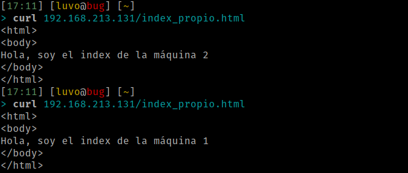
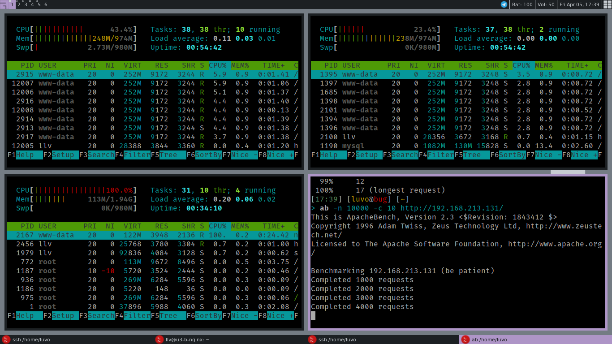
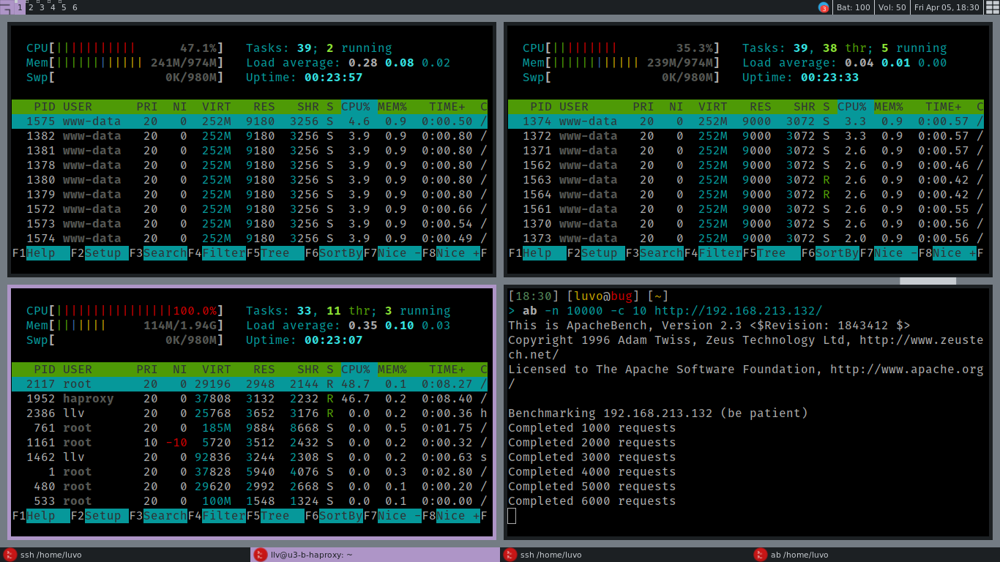

# Practica 3

## Balanceo de carga

Para esta practica vamos a configurar ods maquinas virtuales con nginx y con
haproxy para balancear la carga entre las dos maquinas virtuales que
configuramos previamente en practicas anteriores.

## NGINX

Primero paramos a instalar nginx con el siguiente comando:

```sh
sudo apt install nginx
sudo systemctl start nginx
```

Despues de instalar correctamente **nginx** pasaremos a confirgurarlo
modificando el fichero `/etc/nginx/conf.d/default.conf`, en nuestro caso no
existia, asique lo creamos y nos queda así:

```nginx
upstream servergroup {
        server 192.168.213.128;
        server 192.168.213.129;
}

server {
        listen 80;
        server_name balanceador_nginx;

        access_log /var/log/nginx/balanceador_nginx.access.log;
        error_log /var/log/nginx/balanceador_nginx.error.log;
        root /var/www/;

        location /
        {
                proxy_pass http://servergroup;
                proxy_set_header Host $host;
                proxy_set_header X-Real-Ip $remote_addr;
                proxy_set_header X-Forwarded-For $proxy_add_x_forwarded_for;
                proxy_http_version 1.1;
                proxy_set_header Connection "";
        }
}
```

Lo ejecutamos con el siguiente comando para ver que todo está correctamente
configurado:

```sh
sudo systemctl start nginx
```

Con las dos maquinas abiertas probamos con el comando cURL con la IP de la nueva
maquina balanceadora:

```sh
curl http://192.168.213.131
curl http://192.168.213.131
```



En este caso se nos pide confirgurar los algoritmo de balanceo por round-robin y
haciendo que la máquina 1 tenga el doble de carga que la máquina 2, por lo que
modificamos la configuracion para ello en la cabecera upstream:

```nginx
upstream servergroup {
        server 192.168.213.128 weight=2 max_fails=4 fail_timeout=20s;
        server 192.168.213.129 weight=1 max_fails=4 fail_timeout=20s;
}
```

Y volvemos a probar con el comando cURL:


Ahora pasaremos a someter el servidor a una alta carga mediante Apache Benchmark
(ab):

`ab -n 1000 -c 10 http://192.168.213.131/index_propio.html`

En la imagen podemos ver la carga de las diferentes maquinas, y podemos apreciar
que la primera maquina tiene una carga  del 48% mientras que la segunda maquina
una del 25% y la maquina balanceadora de un 100%:



## HAPROXY

Ahora configuramos otra maquina virtual con el *haproxy*, para ello primero
debemos instalarlo:

```sh
sudo apt install haproxy
```

Para modificar la configuración por defecto, debemos acceder al siguiente
archivo de configuracion, `/etc/haproxy/haproxy.cfg`.

Hay que asegurarse de que el trafico de datos se hace a través del puerto 80 y
redirigirlo a alguna maquina final con sus respectivas IPs. La configuración nos
quedaría así:

```haproxy
global
  daemon
  maxconn 256

defaults
  mode  http
  timeout connect 5000
  timeout client  50000
  timeout server  50000
  errorfile 400 /etc/haproxy/errors/400.http
  errorfile 403 /etc/haproxy/errors/403.http
  errorfile 408 /etc/haproxy/errors/408.http
  errorfile 500 /etc/haproxy/errors/500.http
  errorfile 502 /etc/haproxy/errors/502.http
  errorfile 503 /etc/haproxy/errors/503.http
  errorfile 504 /etc/haproxy/errors/504.http

frontend http-in
  bind *:80
  default_backend servergroup

backend servergroup
  server  u1 192.168.213.128 maxconn 32
  server  u2 192.168.213.129 maxconn 32
```

Nos aseguramos que no hay ningun usuario utilizando el puerto 80 con el comando:

```sh
sudo fuser -k 80/tcp
```

Ahora ejecutamos el servidor:

```sh
sudo /usr/sbin/haproxy -f /etc/haproxy/haproxy.cfg
```

Y probamos que funciona correctamente con el comando cURL:

```sh
curl http://192.168.213.132
curl http://192.168.213.132
```


Ahora modificaremos la configuracion para que la maquina 1 tenga mas carga que
la 2, dándole más peso añadiendo *weight X*:

```haproxy
backend servergroup
        server  u1 192.168.213.128 maxconn 32 weight 2
        server  u2 192.168.213.129 maxconn 32 weight 1
```

Y volvemos a probar con el comando cURL:


Por ultimo pasaremos a someter el servidor a una alta carga mediante **Apache
Benchmark** (ab) como en el caso anterior de *nginx*.

```
ab -n 1000 -c 10 http://192.168.213.131/index_propio.html
```


