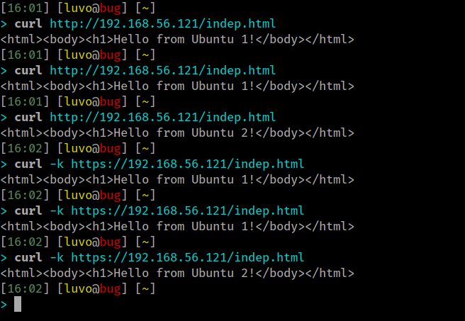

## Configuración ssl

### Configuración ssl en la primera máquina


Activamos el módulo ssl de Apache:

```bash
a2enmod ssl
service apache2 restart
```

Creamos el directorio para el certificado y su clave, y los generamos:

```bash
mkdir /etc/apache2/ssl
openssl req -x509 -nodes -days 365 -newkey rsa:2048 -keyout \
        /etc/apache2/ssl/apache.key -out /etc/apache2/ssl/apache.crt
```

Configuramos apache para que utilice ssl. Para ello modificamos las siguientes
líneas del archivo `/etc/apache2/sites-available/default-ssl.conf`:

```apache
SSLCertificateFile /etc/apache2/ssl/apache.crt
SSLCertificateKeyFile /etc/apache2/ssl/apache.key
```

Activamos el sitio default-ssl y reiniciamos apache:

```bash
a2ensite default-ssl
service apache2 reload
```

Podemos comprobar el funcionamiento haciendo curl:

```bash
curl -k https://192.168.56.101
```


### Configuración ssl en la segunda máquina

Activamos el módulo ssl de Apache:

```bash
a2enmod ssl
service apache2 restart
```

Creamos el directorio para el certificado y su clave, y los copiamos desde la
máquina 1:

```bash
mkdir /etc/apache2/ssl
sudo scp swap@192.168.56.101:/etc/apache2/ssl/* /etc/apache2/ssl/
```

Modificamos las siguientes líneas del archivo
`/etc/apache2/sites-available/default-ssl.conf` para que apache utilice ssl:

```apache
SSLCertificateFile /etc/apache2/ssl/apache.crt
SSLCertificateKeyFile /etc/apache2/ssl/apache.key
```

Activamos el sitio default-ssl y reiniciamos apache:

```bash
a2ensite default-ssl
service apache2 reload
```

```bash
curl -k https://192.168.56.102
```


### Configuración ssl en la máquina balanceadora

Creamos un directorio para el certificado y su clave y los copiamos de
cualquiera de las máquinas anteriores:

```bash
sudo mkdir /etc/nginx/ssl
sudo scp swap@192.168.56.101:/etc/apache2/ssl/* /etc/nginx/ssl
```

Añadimos las siguientes líneas del archivo
`/etc/nginx/conf.d/default.conf` para que nginx permita `https` (a parte de
`http`):

```nginx
listen 443 ssl;
ssl_certificate         /etc/nginx/ssl/apache.crt;
ssl_certificate_key     /etc/nginx/ssl/apache.key;
```

Reiniciamos nginx:

```bash
sudo systemctl restart nginx
```

Y comprobamos si funciona:

```bash
curl http://192.168.56.121/indep.html
curl -k https://192.168.56.121/indep.html
```



### Configuración de cortafuegos

Clonamos la maquina U1, y como está configurado el ssl creamos un script de cortafuegos llamado `setup_iptable_firewall` en */usr/bin*:

```bash
#!/usr/bin/env bash

# (1) Eliminar todas las reglas (configuración limpia)
iptables -F;
iptables -X;
iptables -Z;
iptables -t nat -F;

# (2) Política por defecto: denegar todo el tráfico
iptables -P   INPUT DROP
iptables -P  OUTPUT DROP
iptables -P FORWARD DROP

# (3) Permitir cualquier acceso desde localhost (interface lo)
iptables -I  INPUT -i lo -j ACCEPT
iptables -A OUTPUT -o lo -j ACCEPT

#Permitir conexiones ya establecidas o relacionadas (para otros servers web, u otras conexiones al exterior)
iptables -I INPUT -m state --state ESTABLISHED,RELATED -j ACCEPT

# (4) Abrir el puerto 22 para permitir el acceso por SSH
iptables -A  INPUT -p tcp --dport 22 -j ACCEPT
iptables -A OUTPUT -p tcp --sport 22 -j ACCEPT

# (6) Redirigir tráfico al servidor balanceador
echo "1" > /proc/sys/net/ipv4/ip_forward

publ_dev="enp0s3"
vbox_dev="enp0s8"
balancer_ip="192.168.56.121"
vbox_net_ip="192.168.56.0"

iptables -I FORWARD -i "$vbox_dev" -o "$vbox_dev" -j ACCEPT
iptables -t nat -A PREROUTING -p tcp --dport 80 -j DNAT --to "${balancer_ip}:80"
iptables -t nat -A PREROUTING -p tcp --dport 443 -j DNAT --to "${balancer_ip}:443"
iptables -t nat -A POSTROUTING -s "${vbox_net_ip}/24" -o "$vbox_dev" -j MASQUERADE
```

Para poder ejecutarse el scirpt necesitamos permisos de super usuario y si quieremos ejecutarlo al iniciar la máquina, tenemos que crear una entrada en el crontab del root:

```bash
sudo crontab -eu root
```

Escribimos el siguiente texto en la rutina:

```bash
@reboot /usr/bin/setup_iptables_firewall
```
