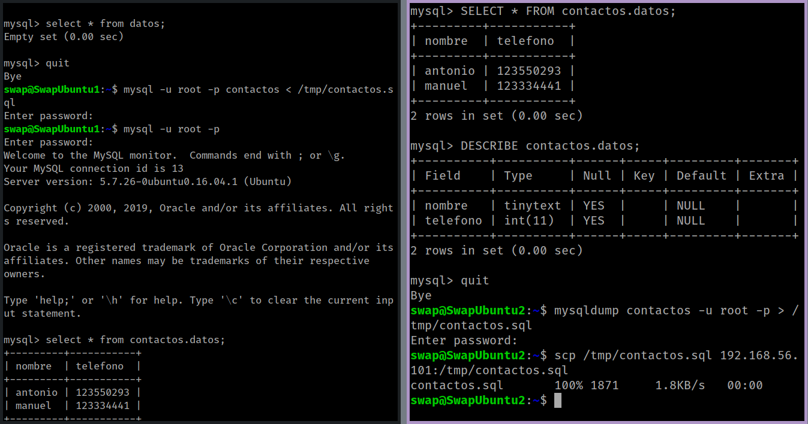
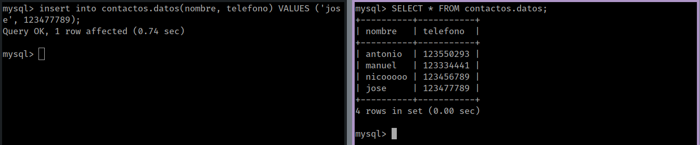

## Replicación de bases de datos MySQL

### Crear una BD e insertar datos

Accedemos a MySQL y con los siguientes comandos creamos una base de datos.

```sql
 #Accedemos a mysql
mysql -uroot -p;

 #Creamos una BS de contactos
CREATE DATABASE contactos;
USE contactos;

 #Creamos una tabla con los datos de nombre y telefono.
CREATE TABLE datos(nombre tinytext,telefono int);
```

Ya tenemos la tabla creada, ahora debemos insertar datos para que no esté vacía.

```sql
INSERT INTO dato(nombre,telefono) VALUES ("Luis, 666666666)
```
Ahora comprobamos que se hayan insertado los datos con una consulta a la base de datos.

```sql
SELECT * FROM datos;
DESCRIBE datos;
```


###Replicación de una BD MySQL con mysqldump

Para poder replicar la BD tenemos que crear la misma BD en la otra maquina que vayamos a utilizar con los comandos anteriores.

Antes de replicar debemos bloquear la base de datos para que no entren datos nuevos:

```sql
mysql -u root -p

FLUSH TABLES WITH READ LOCK;
QUIT
```

Despues de salir de la base de datos, podemos hacer la copia de seguridad con mysqldump.

```bash
mysqldump contactos -u root -p > /tmp/contactos.sql
```

Ahora quitamos el bloqueo de las tablas de la BD.

```sql
mysql -u root -p

UNLOCK TABLES;
quit
```

Si vamos a nuestra máquina esclava y hacemos la copia del archivo sql.

```bash
scp /tmp/contactos.sql 192.168.56.101:/tmp/contactos.sql
```

Como podemos ver la siguiente imagen podemos ver que el archivo se ha copiado correctamente.




### Replicación Automática de BD mediante configuración maestro-esclavo

Primero debemos declarar que maquina es la maestra y cual la esclava, editando el archivo `/etc/mysql/mysql.conf.d/mysqld.cnf`.

Comentamos la linea para que nuestro servidor maestro no escuche a otro.

```
#bind-addres 127.0.0.1
```

Y nos aseguramos de que los siguientes parametros estan correctamente.

```
log_error = /var/log/mysql/error.log

# Identificador de nuestra maquina
server-id = 1

log_bin = /var/log/mysql/bin.log
```

Guardamos los cambios y reiniciamos el servicio.

```
/etc/init.d/mysql restart
```

Ahora pasamos a configurar nuestra maquina esclava. Primero cambiamos el identificador de la maquina a 2, `server-id = 2`, guardar cambios y reiniciar servicio.

Los demás cambios se deben hacer desde el servicio mysql en nuestro servidor maestro.

```sql
CREATE USER esclavo IDENTIFIED BY 'esclavo';

GRANT REPLOCATION SLAVE ON *.* TO 'esclavo'@'%' IDENTIFIED BY 'esclavo';

FLUSH PRIVILEGES;

FLUSH TABLES;

FLUSH TABLES WITH READ LOCK;
```

Continuamos ahora con nuestra maquina esclava e introducimos los datos de la maestra desde el servicio de MySQL.

```sql
CHANGE MASTER TO MASTER_HOST='192.168.56.101', MASTER_USER='esclavo', MASTER_PASSWORD='esclavo',MASTER_LOG_FILE='bin.000001', MASTER_LOG_POS=980,MASTER_PORT=3306;

# Y arrancamos el esclavo
START SLAVE;
```

Por ultimo en nuestra maquina maestra volvemos a activar las tablas.

```sql
UNLOCK TABLES;
```

Para comprobar que todo funciona correctamente, podemos en la maquina esclava utilizar el siguiente comando, realizando cambios en la maestra y viendo que se aplican correctamente en la esclava.

```sql
SHOW SLAVE STATUS\G
```

