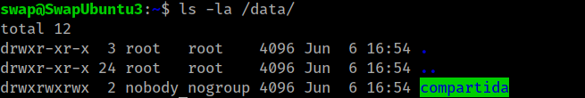
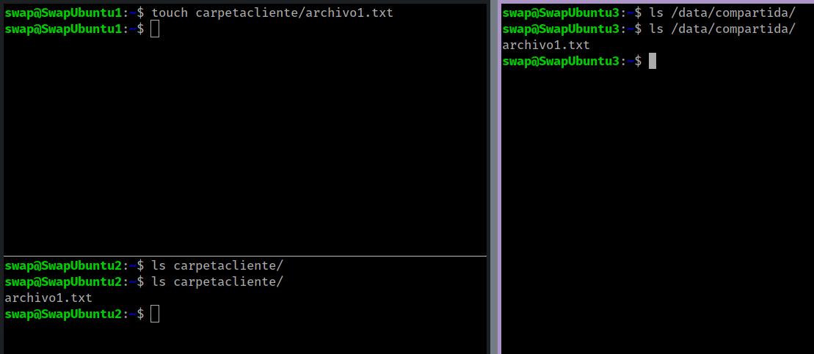

## Servidor de disco NFS

Se nos pide configurar una maquina servidor de disco NFS(192.168.56.103) para que exporte una carpeta a otras dos máquinas clientes (192.168.56.101 / 192.168.56.102), de forma que todas las maquinas puedan acceder a los archivos que se guarden en ese directorio compartido.

### Configurar servidor NFS

Antes que nada instalamos todo los necesario en nuestra máquina servidora:

```bash
sudo apt-get install nfs-kernel-server nfs-common rpcbind
```

Ahora creamos el directorio que queremos compartir con el resto de maquinas cliente y le cambiamos el propietario y los permisos de esa carpeta:

```bash
mkdir /data/compartida
sudo chown nobody:noground /data/compartida/
sudo chmod -R 777 /dat/compartida/
```


Para poder permitir a las maquinas clientes que puedan acceder al directorio, añadimos sus IP en el archivo de configuración `/etc/exports`:

```
/data/compartida 192.168.56.101(rw) 192.168.56.102(rw)
```

Y reiniciamos el servicio:

```bash
sudo service nfs-kernel-server restart
```

### Configurar los clientes

En los clientes instalamos los siguientes paquetes:

```bash
sudo apt-get install nfs-common rpcbing
cd /home/swap/
mkdir carpetaclinete
chmod -R 777 carpetacliente
```

Ahora montamos la carpeta remota sobre este directorio recién creado:

```bash
sudo mount 192.168.56.103:/data/compartida/ carpetacliente
```

Podemos comprobar que se copian correctamente el archivo `prueba1.txt` en nuestras carpetas compartidas:




Para termina debemos configurar todo de forma permanente añadiendo una linea al archivo `/etc/fstab` para conservar la confirmación con cada reinicio del sistema en ambas máquinas clientes:

```
192.168.56.103:/data/compartida/ /home/swap/carpetacliente nfs auto,noatime,nolock,bg,nfsvers=3,intr,tcp,actimeo=1800 0 0
```

Tras reiniciar el sistema la carpeta compartida se montaría y quedaría disponible automáticamente.

