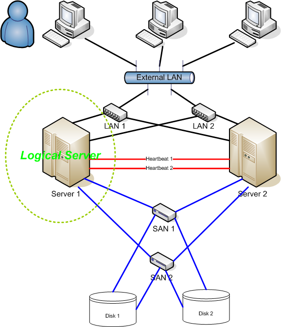

# HeartBeat

[Francisco Javier Perez Heredia](https://github.com/FranJPerez)

[Jorge Palma Ramirez](https://github.com/PepeWalker)

[Luis Liñán Villafranca](https://github.com/lulivi)

## Introducción

El “heartbeat” es un servicio (demonio) de codigo abierto que proporciona la
funcionalidad de infraestructura de clúster a sus clientes, para que estos
tengan conocimientos de los procesos que hay en ejecución en las máquinas y
puedan intercambiar mensajes con ellas.

Nosotros usaremos heartbeat para hacer replicación de balanceadores, es decir,
si el balanceador activo falla, el segundo que estaría en espera (pasivo),
pasaría a ser el activo. A esto se le llama una configuración Activo-Pasiva.

## Clúster

Para entender bien el funcionamiento del heartbeat, primero hay que entender
que es un clúster. Es un conjunto de computadores que actúan como si fueran uno
ya que están unidos mediante una red de alta velocidad.

La reciente evolución de los clústers se debe a la disponibilidad de micro
procesadores de alto rendimiento económicos, las redes de alta velocidad y el
desarrollo de herramientas de software para cómputo distribuido de alto
rendimiento. Los clústers son usualmente empleados para mejorar el rendimiento
y la disponibilidad.

Los clúster pueden ser de diferentes tipos:

-   Alto rendimiento.

    Están diseñados para prestar gran capacidad de calculo. Son usados para
    problemas de gran tamaño que pueden ser paralelizados y distribuidos entre
    los distintos nodos del cluster.

    

-   Alta disponibilidad.

    El clúster de alta disponibilidad y el que vamos a implementar con
    heartbeat, es un conjunto de maquinas que se usan para mantener un conjunto
    de servicios replicados y que se están monitorizando constantemente entre
    si.

    Este tipo de clúster puede dividirse a su vez en dos tipos:

    -   Activo-Pasivo: El nodo primario esta activo y atiende todas las
        solicitudes. En caso de que falle, las peticiones se redirigen al nodo
        secundario, ya sea a través de la conmutación de error automática o
        manual.

    -   Activo-Activo: ambos nodos permanecen activos todo el tiempo y atienden
        sus respectivas solicitudes. Si uno de los dos cae, las peticiones que
        atendía este nodo, son redirigidas al otro.

    

-   Alta disponibilidad de infraestructura.

    Este tipo se usa para suplir los fallos de hardware en alguna de las
    maquinas del cluster. Cuando ocurre el fallo, es capaz de arrancar este
    servicio desde otra de las máquinas del clúster (failover). Cuando la
    máquina caída se recupera, se le devuelve los servicios derivados
    automáticamente (failback). De esta manera se garantiza la alta
    disponibilidad de los servicios ofrecidos por el clúster.

-   Balanceo de carga.

    Este concepto se refiere al trabajo que se realiza entre varios
    computadores por el cual una maquina se encarga de repartir el trabajo
    entre los distintos computadores que componen el cluster.

    

## Escalabilidad.

La escalabilidad es la propiedad deseable de un sistema o red de sistemas que
indica que tiene un margen para extender sus operaciones cambiando su tamaño o
configuración para adaptarse a grandes cambios. Debido a la gran demanda de
servicios web que hay actualmente y siendo esto algo que crece dia a dia.


Por lo tanto partir de este punto trataremos los diferentes software que
podemos usar para crear nuestros propios clúster de alta disponibilidad. Nginx
y HAProxy ya los hemos usado en clase, por lo que los trataremos con menos
profundidad y por ultimo hablaremos de Heartbeat y realizaremos una
demostración.

## Nginx

Es un servidor web de alto rendimiento y un proxy para protocolos de correo
electrónico (IMAP/POP3). Es de software libre y tiene una versión comercial
llamada Nginx Plus, la cual ofrece funcionalidades como persistencia de sesión
basada en cookies o la integración del servicio DNS. Nació como competencia de
los servidores web de apache y es usado por sitios web tan importantes como
Netflix, Hulu, GitHub, etc.

Nginx, nació para satisfacer las necesidades de sitios web que recibían más de
500 millones de peticiones en 2008. Y para 2019 Nginx estaba entre el primer
millón de servidores web con mayor trafico, aunque Apache sigue dominando el
mercado.

Algunas de las características básicas de un servidor web, y por tanto Nginx,
según wikipedia, seria:

- Servidor de archivos estáticos, indice y auto indexado.
- Proxy inverso con opciones de caché
- Balanceo de carga.
- Tolerancia a fallos.
- Soporte de HTTP y HTTP2 sobre SSL.
- Soporte para FastCGI con opciones de caché.
- Servidores virtuales basado en nombre y/o en dirección IP.
- Streaming de archivos FLV y MP4.
- Soporte de autentifican.
- Compatible con Ipv6.
- Soporte para protocolo SPDY.
- Compresión gzip.
- Habilitad para soportar mas de 10.000 conexiones simultaneas.

## Funcionamiento

Como hemos comprobado en clases practicas, el funcionamiento de Nginx es
sencillo e intuitivo y no ahondaremos más de un breve tutorial de uso, tal y
como hemos realizado en practicas.

Lo primero es su instalación con el comando `sudo apt-get install nginx`. La
lista de comandos para su manipulación sería:

```bash
sudo systemctl stop nginx
sudo systemctl start nginx
sudo systemctl restart nginx
sudo systemctl reload nginx
sudo systemctl disable nginx
```

Luego tenemos dos directorios importantes sobre los que actúa Nginx. El primero
es `/var/www/html` Que sera donde se almacene el contenido web

Y luego `/etc/nginx/nginx.conf` El cual es el archivo de configuración de
nginx, el cual sera el que modifiquemos para usar las diferentes
características de Nginx.

## Heartbeat

Heartbeat es un servicio que proporciona la funcionalidad de clúster hacia el
cliente y puede trabajar con tantos nodos como se requiera. Nació como parte
del proyecto “The High Availability Linux”, el cual proporciona soluciones de
clústering de alta disponibilidad para una amplia gama de sistemas operativos.


Este proceso necesita combinarse con un gestor de recursos del clúster(Clúster
Resource Manager - CRM), el cual inicia los servicios (dir IP, servidores web,
etc.) a los cuales el clúster aporta alta disponibilidad.

Pacemaker es el gestor más usado para Heartbeat, el cual puede configurarse de
forma pasiva y/o activa.

### Configuración

Vamos a usar una arquitectura de alta disponibilidad a través de dos nodos,
pero primero debemos asignar el nombre de los host y sus direcciones para hacer
posible que se comuniquen entre ellos. Para ello, deberemos modificar dos
archivos de cada uno de los nodos balanceadores.

```
Servidor 1
    HostName 192.168.56.101

Servidor 2
    HostName 192.168.56.102

Balanceador Activo
    HostName 192.168.56.121

Balanceador Pasivo
    HostName 192.168.56.122
```

En el archivo */etc/hosts* añadimos las IP's de los nodos con sus respectivos
nombres (los que aparecen en */etc/hostname* de cada máquina):

```
...
192.168.56.122 SwapNginxActive
192.168.56.121 SwapNginxPassive
...
```

Comprobamos que efectivamente se pueden hacer ping entre ellos:


Ahora vamos a instalar **Heartbeat**:

```bash
sudo apt-get install heartbeat -y
```

Para configurar Heartbeat modificamos el archivo `ha.cf` alojado en
*/etc/ha.d/ha.cf* introduciendo las siguientes líneas:

```
use_logd on
keepalive 2
deadtime 30
warntime 10
initdead 120
udpport 694
ucast enp0s8 192.168.56.101
ucast enp0s8 192.168.56.102
auto_failback on
node SwapNginxActive
node SwapNginxPassive
```

- `use-log`: especifica si queremos un servicio demonio de registro de mensajes
  entre maquinas y solicitudes.
- `keepalive`: especifica el numero de segundos entre dos heartbeats.
- `deadtime`: especifica el numero de segundos después de que el host se
  considera muerto si no responde.
- `warntime`: especifica el numero de segundos después de que el ultimo
  Hearbeat avise de cualquier posible problema.
- `initdead`: el numero de segundos de espera para otro host después de empezar
  Hearbeat, antes se considera muerto.
- `udpport`: es el numero de puesto usado por comunicaciones *ucast*. Por
  defecto es el puerto UDP 694.
- `ucast`: es la interfaz en la que se hará el *unicast*.

A continuación necesitamos indicar a Heartbeat cuales son los recursos que va a
administrar. Hay varias formas de hacerlo. Nosotros vamos a usar *haresources*.

Para ello accedemos al `/etc/ha.d/haresources` y añadimos lo siguiente en ambas
máquinas:

```
SwapNginxActive <ServiceIP> nginx
```

`SwapNginxActive` es el nombre del host que utilizaremos como nodo activo, la
`ServiceIp` se refiere a la dirección IP por la que accederán los clientes a
los servidores, y `nginx` es el servicio que ejecutará HeartBeat.

Para evitar que el nginx se inicie con el sistema escribimos los siguientes
comandos en cada máquina:

```bash
sudo systemctl stop nginx
sudo systemctl disable nginx
```

Ahora iniciamos Heartbeat:

```bash
sudo systemctl start heartbeat
sudo systemctl enable heartbeat
```

### Demo

Aquí podemos ver el servidor activo funcionando correctamente:


Observamos que el balanceador activo tiene 2 ip's, la `ip` de la máquina, y la
`ip` secundaria (`ServiceIP`).

Aquí una vez apagado el balanceador activo:


En esta segunda imagen vemos que la `ServiceIp` se ha pasado a la máquina
pasiva.

## Referencias

- [Heartbeat](http://linux-ha.org/wiki/Heartbeat)

- [Building A Highly Available Nginx Reverse-Proxy Using Heartbeat](https://opensourceforu.com/2009/03/building-a-highly-available-nginx-reverse-proxy-using-heartbeat/)
- [How to Setup MariaDB High Availability with Heartbeat and DRBD on Ubuntu 16.04 LTS](https://www.howtoforge.com/tutorial/ubuntu-drbd-heartbeat-high-availability/)

- [DRBD – Heartbeat (Active/Passive High Availability Cluster)](https://syslint.com/blog/tutorial/drbd-%E2%80%93-heartbeat-activepassive-high-availability-cluster/)

- [How To Create a High Availability Setup with Heartbeat and Floating IPs on Ubuntu 14.04](https://www.digitalocean.com/community/tutorials/how-to-create-a-high-availability-setup-with-heartbeat-and-floating-ips-on-ubuntu-14-04)
